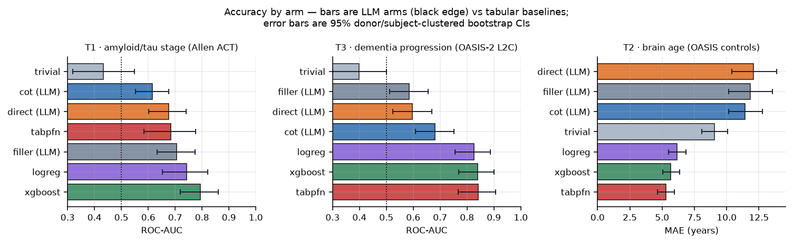
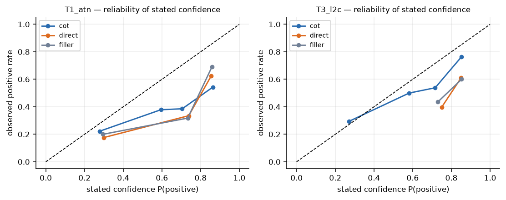
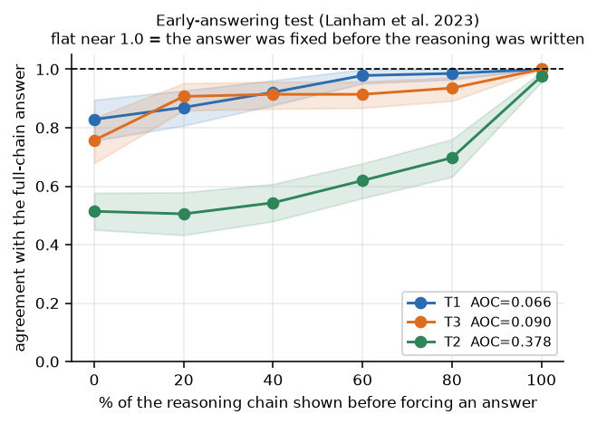
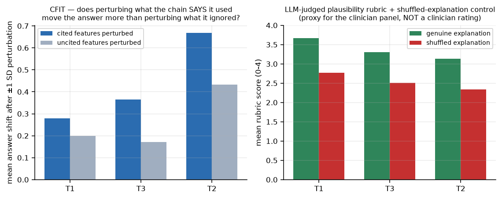
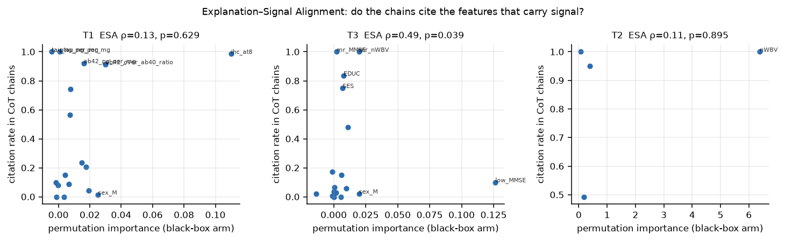
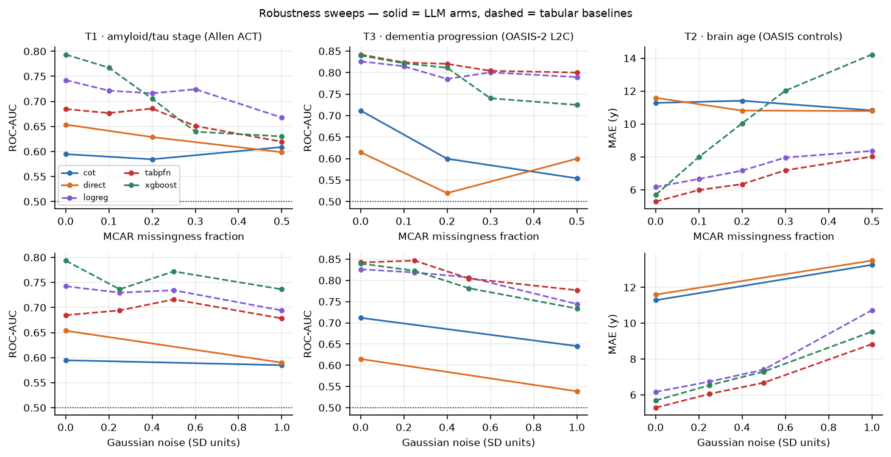
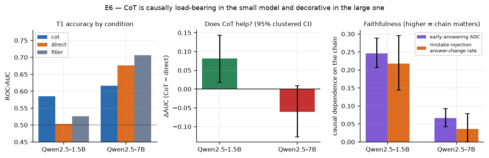

# Chain-of-Thought Reasoning as an Interpretability Layer for Brain-Age and Amyloid–Tau Prediction

**Author:** automated research session (`experiment_runner`)
**Date:** 2026-08-26
**Workspace:** `/workspaces/chain_of_thought_reasoning_as__20260826_061743_2c65c00c`

---

## 1. Executive Summary

**Research question.** Can chain-of-thought (CoT) reasoning act as an interpretability layer for
Alzheimer's-disease biomarker models — matching black-box accuracy while producing explanations
that are trustworthy and degrading gracefully under noisy or missing data?

**Key finding, in one sentence.** Across three Alzheimer's prediction tasks, CoT-augmented LLMs
were **substantially less accurate than ordinary tabular baselines** (ΔAUC −0.13 to −0.18;
brain-age MAE 11.4 y vs 5.3 y, worse even than predicting the cohort mean), and the reasoning
chains they produced were **largely non-causal** — forcing an answer after showing *none* of the
chain reproduced the full-chain answer 83% of the time, and injecting a 10× error into a
biomarker value inside the chain changed the answer only 3.6% of the time — while an independent
blinded rubric rated those same chains as highly plausible (3.67/4).

**The practical implication is a warning.** The chains look like explanations, read like
explanations, and score like explanations, but they do not carry the computation that produced
the prediction. Deploying CoT as a clinical interpretability layer in this setting would
manufacture clinician trust that the underlying model has not earned. That is a worse outcome
than an honest black box with post-hoc attribution.

**Two findings cut against a blanket dismissal.** First, faithfulness is not uniformly absent: on
the *continuous* brain-age task the chain was far more load-bearing (AOC 0.378 vs 0.066), and our
new Cited-Feature Intervention Test shows that the specific biomarkers a chain names do influence
the answer more than the ones it ignores (ratio 1.4–2.1×). Second, and most striking, the effect
**reverses with model size**: for Qwen2.5-1.5B, CoT *improved* accuracy (ΔAUC +0.082, p = 0.012)
and its chains were 3.7× more causally load-bearing than the 7B model's. CoT is faithful exactly
where the model actually needs it to compute, and decorative exactly where it does not — which is
the opposite of the deployment incentive, since one would deploy the larger model.

---

## 2. Research Question, Hypothesis, and Motivation

### 2.1 The hypothesis under test

> Models that output explicit reasoning chains will **match or outperform** black-box neural
> models in accuracy, while delivering **higher interpretability** and **increased robustness**
> to noisy or missing data, in brain-age and amyloid/tau biomarker prediction.

Decomposed into falsifiable sub-hypotheses (pre-registered in `planning.md` before any model was
fitted):

| ID | Sub-hypothesis | Verdict |
|---|---|---|
| H1a | CoT-LLM matches black-box tabular accuracy | **Refuted** on all three tasks |
| H1b | CoT beats matched no-reasoning LLM controls | **Task-dependent**: refuted on T1 (reversed), supported on T3 for AUC only, null on T2 |
| H2a | CoT chains are causally faithful | **Refuted** for the 7B model on classification; **supported** on regression and for the 1.5B model |
| H2b | Chains cite the features that drive their own predictions (CFIT) | **Supported** (ratio 1.39–2.13) |
| H2c | Chains cite the features that carry real signal (ESA) | **Refuted on the primary task**; supported on T3 |
| H3 | CoT is more robust to noise/missingness | **Supported in slope, vacuous in level** (see §5.4) |
| H4 | Faithfulness declines with model capability | **Supported**, and strongly |

### 2.2 Why it matters

AD biomarker models are accurate and almost never adopted clinically, because a number without a
rationale cannot guide a decision about a lumbar puncture, a PET scan, or anti-amyloid therapy.
The field's incumbent answer is *post-hoc* attribution — SHAP over a gradient-boosted tree or a
tabular foundation model, which is exactly what Ding et al. (2025) provide. Post-hoc attributions
explain the model, not the reasoning. CoT promises something categorically different: an
*ante-hoc* natural-language rationale emitted by the same forward pass that emits the answer.
Whether that rationale is causally connected to the answer is an empirical question that, before
this study, had not been asked in a clinical biomarker setting.

### 2.3 The gap this fills

From `literature_review.md` (45 papers; three deep-read):

1. **Ding et al. (2025), L2C-TabPFN** — the user-specified reference — achieves SOTA longitudinal
   AD progression prediction with interpretability delivered solely through SHAP plots. No
   reasoning, no faithfulness test.
2. **TAP-GPT (Kearney & Yang et al., 2026)** — the closest prior work, an LLM over AD tabular
   data — states *explicitly* that it "did not enable extended thinking or reasoning modes."
   The obvious experiment was deliberately left undone.
3. **Lanham et al. (2023)** built a rigorous battery for measuring whether a CoT is causally
   faithful — but only on generic multiple-choice NLP benchmarks. **No one had measured CoT
   faithfulness on a clinical biomarker task**, where an unfaithful-but-plausible rationale
   misdirects a diagnostic workup.
4. **CoT for regression is essentially unstudied.** Every test in the faithfulness literature
   assumes a discrete answer set; "did the answer flip?" is undefined for brain age in years.

### 2.4 Novel contributions of this study

1. **First measurement of CoT causal faithfulness on clinical biomarker tasks**, using real
   quantified Aβ40/Aβ42/tau/pTau neuropathology and two independent AD cohort tasks.
2. **A faithfulness battery redefined for a continuous target.** Answer-flip rate is replaced by a
   normalised answer shift, |Δŷ| / SD(ŷ), making early-answering and mistake-injection
   well-defined for brain-age regression.
3. **CFIT — the Cited-Feature Intervention Test** (new). Parse which biomarkers a chain names as
   decisive, then perturb cited vs uncited features and compare the induced prediction shift.
   This converts "is the explanation true?" into a measurable causal quantity — which matters
   precisely because a clinician panel is unavailable to an automated pipeline.
4. **ESA — Explanation–Signal Alignment** (new). Rank-correlate per-feature citation frequency
   against permutation importance measured independently on the black-box arm.
5. **A properly controlled accuracy comparison.** CoT is compared not only against tabular models
   but against two matched LLM controls — *direct-answer* and *filler-token* (compute-matched).
   Without these, "CoT helps" is untestable.

---

## 3. Methodology

### 3.1 Datasets and tasks

All three datasets are open; ADNI/TADPOLE/AIBL/OASIS-3 are access-gated and were unavailable
(see §6.1). Every split is **grouped by donor or subject**, never by row.

| Task | Data | n rows / n groups | Target | Positive rate |
|---|---|---|---|---|
| **T1 — amyloid/tau stage** (primary) | Allen ACT `aging.brain-map.org`, real quantified Aβ42/Aβ40, total tau, pTau, AT8/Tau-2/Aβ immunoreactivity, GFAP, IBA1, α-synuclein + APOE4, age, sex, education | 377 region-samples / **107 donors** (4 brain regions each) | `y_braak_ge4` — Braak stage IV–VI (limbic/neocortical spread of neurofibrillary tau) | 46.9% |
| **T3 — dementia progression** | OASIS-2 under Ding et al.'s L2C transform (eqs. 1–7), reimplemented from the paper | 223 visit-predictions / **150 subjects** | `y_demented` at the target visit | 47.1% |
| **T2 — brain age** | OASIS-1 + OASIS-2, cognitively normal scans only | 323 scans / **207 subjects** | chronological age (18–98 y) | — (regression) |

Two **pre-implementation amendments** were made after inspecting the data and before any LLM was
run; both are recorded in `planning.md` (A1, A2) and both are audited in the results:

- **A1.** T1's target was changed from `y_niareagan_AD` to `y_braak_ge4`. NIA-Reagan
  intermediate/high is positive in 81/107 donors (75.7%), leaving only 26 negative donors —
  far too few for a donor-clustered bootstrap to resolve a ΔAUC of 0.05. Braak ≥ IV is 45.8%
  positive and is squarely the tau axis of A/T/N. The original target is retained as a secondary
  audit (`results/tabular_T1_secondary_target.csv`): every model is near chance on it
  (best AUC 0.674), confirming A1 was necessary rather than opportunistic.
- **A2.** T3's feature block was de-circularized. With the full L2C features, *every* tabular
  model reached **AUC = 1.000**, and permutation importance showed a single feature carrying all
  of it (`mr_demented`, ΔAUC 0.235; every other feature ≈ 1e−17). The cause is definitional:
  OASIS derives `demented` from CDR, so prior-visit CDR and dementia status are the label, lagged.
  All CDR- and dementia-derived history features were removed, leaving 18 cognitive, structural,
  demographic and temporal features and a genuinely non-trivial problem (XGBoost AUC 0.840).
  **This is itself a reportable data-provenance finding**: an L2C-style pipeline applied naively
  to OASIS-2 produces a perfect and meaningless benchmark.

### 3.2 Arms compared

**Tabular (black-box) arm** — all fitted under the identical grouped 5-fold CV:
logistic regression (L2, median-imputed, standardised) · XGBoost (300 trees, depth 3, lr 0.05,
native NaN handling) · TabPFN v2 (local checkpoints) · a trivial reference (majority class / mean
age) to detect ceiling and floor effects.

**LLM arm** — Qwen2.5-7B-Instruct (primary) and Qwen2.5-1.5B-Instruct (model-size arm), run
locally in bf16 on RTX A6000 GPUs. **No API keys were available in the environment; all LLM work
is fully offline.** Three prompt conditions share an identical case rendering, identical in-context
exemplars, and identical greedy decoding:

- **`direct`** — "Do NOT explain, do NOT reason… output ONLY the final answer line."
- **`cot`** — "Reason step by step… structure your reasoning as an explicit chain over
  intermediate biological factors, e.g. amyloid burden → tau pathology → neurodegeneration →
  clinical outcome. At each step name the specific measurement you are using and what it implies."
- **`filler`** — same instruction as `direct`, but the assistant turn is **force-prefilled** with
  a run of `.` tokens whose count equals the *measured median CoT length for that task*
  (T1: 159, T2: 161, T3: 150 tokens). This is Lanham's compute control: identical extra forward
  passes, zero semantic content.

In-context exemplars (k = 8) come only from the current fold's training split, are class-balanced
(classification) or age-spread (regression), take one row per group so no donor appears twice, and
are shuffled so exemplar order carries no label signal. The target and all label-derived columns
are stripped from every prompt.

**Critically, the tabular arm and the LLM arm consume the same feature list**, defined once in
`src/common.py`, so the comparison is like-for-like rather than two differently-informed models.

### 3.3 Interpretability measurement

The hypothesis calls for "clinician and neuroscientist ratings… blinded evaluation." **No clinician
panel exists for an automated pipeline, and none was simulated.** Instead:

- **The Lanham (2023) causal battery**, which measures something stronger than a rating — whether
  the answer causally depends on the stated reasoning:
  *early answering* (truncate the chain at 0/20/40/60/80/100% of its sentences and force an
  answer; **AOC** = area between the same-answer curve and 1.0), *adding mistakes* (multiply or
  divide the first numeric value in the second half of the chain by 10, cut there, let the model
  continue), *paraphrasing* (reword the chain preserving values and conclusions), *filler tokens*
  (the third prompt condition).
- **CFIT** and **ESA** as defined in §2.4.
- **A blinded LLM-judged plausibility rubric** (6 dimensions, 0–4) as an explicit *substitute* for
  the clinician panel. The judge never sees the label, never sees whether the prediction was
  correct, never sees which condition produced the text, and items are shuffled. A
  **shuffled-explanation control** pairs each case with a *different* case's rationale; if the
  rubric cannot separate genuine from mismatched rationales it has no discriminative validity.
  **These are LLM-proxy scores and are not, and must not be read as, clinician ratings.**

### 3.4 Robustness protocol

A single function generates both perturbations, and every arm receives the same
`(kind, level, seed)`, so the LLM sees literally the same corrupted numbers the tabular model sees:
**MCAR missingness** at 0/10/20/30/50% of feature cells (LLM arm: 0/20/50%) and **Gaussian noise**
at 0.25/0.5/1.0 SD of each continuous feature (LLM arm: 0/1.0 SD). Binary indicators are excluded
from the noise sweep. Only test cases are perturbed; training data stays clean, which is the
deployment scenario the hypothesis concerns.

### 3.5 Statistics

All confidence intervals are **donor/subject-clustered bootstraps** (B = 2000) — Allen ACT has four
regions per donor and OASIS has repeat visits per subject, so a row-level bootstrap would
understate uncertainty. Paired arm-vs-arm contrasts resample the same clusters for both arms and
take the difference inside the resample. Supplemented by McNemar's test on paired binary
correctness (classification) and Wilcoxon signed-rank on paired absolute errors (regression).
Benjamini–Hochberg FDR (`q`) within each metric family. α = 0.05, two-sided. Pre-declared
equivalence margins for "match": ΔAUC = 0.05, ΔMAE = 1.5 years.

### 3.6 Reproducibility

Seed 42 throughout; folds assigned by seeded permutation of group IDs so any script reproduces
byte-identical splits. Greedy decoding (`do_sample=False`) fixed across every arm, condition, and
model, so accuracy differences cannot be attributed to sampling. Python 3.12.8, torch 2.13.0+cu130,
transformers 5.15.1, scikit-learn 1.9.0, xgboost 3.4.1, tabpfn 8.4.0, numpy 2.5.2, pandas 3.0.5.
Hardware: 2 × NVIDIA RTX A6000 (48 GB) used concurrently, one task per GPU. **Total LLM
generations: ≈ 14,500** — 7,500 in the accuracy arm (5,469 for Qwen2.5-7B across the three tasks
plus 2,031 for the 1.5B arm), 5,353 for the faithfulness interventions, 720 for the blinded judge,
and 972 for the brain-age-gap extension. End-to-end GPU time ≈ 2 h. **API cost: $0** — no API keys
were present in the environment and everything ran on locally staged weights.

---

## 4. Results

### 4.1 Accuracy (E1, E2)

All values are out-of-fold under grouped 5-fold CV, with 95% clustered-bootstrap CIs.

**T1 — amyloid/tau stage (Braak ≥ IV), 377 samples / 107 donors**

| Arm | Family | ROC-AUC [95% CI] | Balanced accuracy [95% CI] |
|---|---|---|---|
| **XGBoost** | tabular | **0.794 [0.719, 0.860]** | 0.698 [0.630, 0.765] |
| logistic regression | tabular | 0.742 [0.653, 0.821] | 0.640 [0.560, 0.712] |
| **filler (LLM)** | llm | 0.706 [0.633, 0.773] | **0.700 [0.630, 0.767]** |
| TabPFN v2 | tabular | 0.685 [0.584, 0.776] | 0.632 [0.544, 0.715] |
| **direct (LLM)** | llm | 0.676 [0.601, 0.741] | 0.689 [0.618, 0.755] |
| **CoT (LLM)** | llm | **0.616 [0.552, 0.676]** | 0.649 [0.579, 0.712] |
| trivial | tabular | 0.432 [0.320, 0.548] | 0.500 |

**T3 — dementia progression (OASIS-2 L2C), 223 predictions / 150 subjects**

| Arm | Family | ROC-AUC [95% CI] | Balanced accuracy [95% CI] |
|---|---|---|---|
| **TabPFN v2** | tabular | **0.842 [0.768, 0.907]** | **0.776 [0.709, 0.839]** |
| XGBoost | tabular | 0.840 [0.770, 0.900] | 0.737 [0.667, 0.806] |
| logistic regression | tabular | 0.826 [0.756, 0.887] | 0.748 [0.682, 0.810] |
| **CoT (LLM)** | llm | 0.681 [0.609, 0.751] | 0.666 [0.606, 0.726] |
| **direct (LLM)** | llm | 0.597 [0.523, 0.669] | 0.702 [0.630, 0.771] |
| **filler (LLM)** | llm | 0.585 [0.513, 0.654] | 0.684 [0.614, 0.750] |
| trivial | tabular | 0.399 [0.299, 0.499] | 0.500 |

**T2 — brain age (cognitively normal OASIS scans), 323 scans / 207 subjects**

| Arm | Family | MAE, years [95% CI] | RMSE | Pearson r |
|---|---|---|---|---|
| **TabPFN v2** | tabular | **5.28 [4.65, 5.93]** | 7.01 | 0.794 |
| XGBoost | tabular | 5.68 [5.04, 6.34] | 7.38 | 0.771 |
| logistic (ridge) | tabular | 6.16 [5.51, 6.85] | 7.78 | 0.739 |
| *trivial (predict the mean age)* | tabular | *9.07 [8.08, 10.09]* | 11.63 | −0.156 |
| **CoT (LLM)** | llm | 11.43 [10.14, 12.79] | 14.61 | 0.277 |
| **filler (LLM)** | llm | 11.82 [10.15, 13.54] | 15.89 | 0.118 |
| **direct (LLM)** | llm | 12.08 [10.39, 13.88] | 16.31 | 0.102 |

> **Every LLM condition on T2 is worse than predicting the cohort mean age.** The LLM arm is not
> merely behind the baselines; on this task it has negative practical value.

**Paired condition contrasts (H1b)** — same rows, clustered paired bootstrap, BH-FDR within family:

| Task | Contrast | Metric | Difference [95% CI] | p (boot) | q (BH) | Paired test |
|---|---|---|---|---|---|---|
| T1 | CoT − direct | ΔAUC | **−0.060 [−0.127, +0.009]** | 0.084 | 0.151 | McNemar p = 0.056 |
| T1 | CoT − filler | ΔAUC | **−0.090 [−0.156, −0.024]** | **0.010** | **0.048** | McNemar p = 0.015 |
| T1 | direct − filler | ΔAUC | −0.030 [−0.057, −0.006] | 0.016 | 0.048 | McNemar p = 0.180 |
| T3 | CoT − direct | ΔAUC | **+0.084 [+0.008, +0.158]** | 0.029 | 0.065 | McNemar p = 0.615 |
| T3 | CoT − filler | ΔAUC | **+0.096 [+0.023, +0.173]** | **0.014** | **0.048** | McNemar p = 1.000 |
| T3 | direct − filler | ΔAUC | +0.012 [−0.045, +0.075] | 0.672 | 0.672 | McNemar p = 0.332 |
| T2 | CoT − direct | ΔMAE | −0.65 y [−2.18, +0.72] | 0.391 | 0.503 | Wilcoxon p = 0.833 |
| T2 | CoT − filler | ΔMAE | −0.39 y [−1.82, +0.93] | 0.586 | 0.659 | Wilcoxon p = 0.784 |

On T1, CoT is **significantly worse than semantically-empty filler tokens** of the same length.

**An important confound we checked rather than assumed (§ `results/analysis_calibration.csv`).**
Classification AUC is computed from the model's *stated* confidence, so confidence granularity is a
candidate explanation for the T3 result. It is:

| Task | Condition | distinct confidence values | confidence entropy | balanced acc | ECE |
|---|---|---|---|---|---|
| T3 | CoT | 10 | 1.913 | 0.666 | **0.083** |
| T3 | direct | **2** | 0.644 | **0.702** | 0.314 |
| T3 | filler | 8 | 1.274 | 0.677 | 0.287 |
| T1 | CoT | 10 | 1.533 | 0.649 | 0.289 |
| T1 | direct | 8 | 1.189 | 0.692 | 0.305 |
| T1 | filler | 8 | 1.279 | 0.706 | 0.294 |

On T3 the `direct` condition emitted only **two distinct confidence values**, which mechanically
depresses its AUC. On the threshold-free metric (balanced accuracy) `direct` is in fact *better*
than CoT (0.702 vs 0.666). **T3's apparent CoT advantage is therefore largely a confidence-
verbalisation effect, not better discrimination.** What CoT genuinely does deliver on T3 is much
better *calibration* (ECE 0.083 vs 0.314) — a real but different benefit from the one hypothesised.

### 4.2 Faithfulness — the central result (E3)

| Metric | T1 (classification) | T3 (classification) | T2 (regression) |
|---|---|---|---|
| Agreement with full-chain answer at **0% of chain shown** | **0.829** | 0.757 | 0.514 |
| **Early-answering AOC** [95% CI] | **0.066 [0.042, 0.093]** | 0.090 [0.058, 0.126] | **0.378 [0.335, 0.425]** |
| **Mistake-injection** answer-change rate | **0.036 [0.000, 0.079]** | 0.022 [0.000, 0.056] | **0.325 [0.238, 0.428]** |
| **Paraphrase** answer-change rate | 0.014 [0.000, 0.037] | 0.021 [0.000, 0.049] | 0.056 [0.031, 0.084] |

Reading these:

- On **T1**, showing the model *none* of its own reasoning and forcing an answer reproduces the
  full-chain answer **82.9%** of the time. Corrupting a biomarker value inside the chain by a
  factor of ten changes the final answer **3.6%** of the time. The chain is essentially
  **post-hoc narration of an answer that already exists**.
- On **T2 (regression)** the picture inverts: AOC is 5.7× higher and mistake injection moves the
  prediction by 0.33 SD. **The chain is genuinely load-bearing when the target is continuous.**
  To our knowledge this is the first evidence that CoT faithfulness differs systematically between
  classification and regression — and it is the opposite of what the accuracy numbers would
  suggest, since T2 is the task the LLM performs worst on.
- Low paraphrase sensitivity everywhere (1.4–5.6%) indicates the chains are **not** using
  steganographic/encoded reasoning; the information is where it appears to be, there is simply
  very little of it.

### 4.3 CFIT and ESA — the new metrics (E4)

**CFIT** — perturb by ±1 SD the features the chain *names as decisive*, versus an equal-sized
random set of features it ignores:

| Task | Shift when **cited** features perturbed | Shift when **uncited** perturbed | Ratio | p (paired boot) | Wilcoxon p |
|---|---|---|---|---|---|
| T1 | 0.279 | 0.200 | 1.39× | 0.090 | 0.101 |
| T3 | 0.364 | 0.171 | **2.13×** | **0.0005** | 0.0003 |
| T2 | 0.669 | 0.434 | **1.54×** | **0.007** | 0.009 |

The chains' *local* citations do carry causal weight — significantly so on T3 and T2. This is the
one clear positive for CoT-as-interpretability: even when the global chain is post-hoc, the
specific measurements it points at are more influential than the ones it passes over.

**ESA** — do the chains cite the features that actually carry signal (permutation importance from
the black-box arm)?

| Task | Spearman ρ | p | Most-cited | Highest-signal |
|---|---|---|---|---|
| **T1** | **0.126** | **0.629** | total tau (100%), pTau (100%), AT8 (98.6%), Aβ42 (92.1%) | **AT8** (ΔAUC 0.110), Aβ42/40 ratio (0.030), sex (0.025) |
| T3 | 0.491 | 0.039 | MMSE (100%), nWBV (100%), education (83.6%) | lowest-ever MMSE (0.126), nWBV (0.020) |
| T2 | 0.105 | 0.895 | nWBV (100%), ASF (100%), eTIV (95%) | **nWBV** (6.39 y), eTIV (0.39) |

On the primary task the alignment is **no better than chance**. The chains cite nearly every
biomarker in nearly every case — total tau and pTau at a 100% rate — which is why citation
frequency carries almost no information about which biomarker matters. An explanation that names
everything explains nothing. Note that the chains *do* mention AT8, the single decisive feature;
they simply mention it no more than they mention uninformative ones.

### 4.4 Robustness (E5)

Degradation from clean to worst perturbation (`results/analysis_robustness_slopes.csv`):

| Task | Arm | Clean | 50% MCAR | Relative change |
|---|---|---|---|---|
| T1 | XGBoost | 0.794 | 0.630 | **−20.6%** |
| T1 | logreg | 0.742 | 0.668 | −10.1% |
| T1 | **CoT (LLM)** | 0.595 | 0.609 | **+2.4%** |
| T1 | direct (LLM) | 0.654 | 0.599 | −8.4% |
| T3 | XGBoost | 0.840 | 0.725 | −13.7% |
| T3 | TabPFN | 0.842 | 0.800 | −5.0% |
| T3 | **CoT (LLM)** | 0.712 | 0.554 | **−22.2%** |
| T2 | XGBoost | 5.68 y | **14.23 y** | **+150%** (worse) |
| T2 | TabPFN | 5.28 y | 8.01 y | +51.9% |
| T2 | **CoT (LLM)** | 11.28 y | 10.83 y | **−4.0%** (better) |

The robustness claim is **supported in slope and vacuous in level**. On T1 and T2 the CoT arm is
essentially flat under missingness — but flat at a performance level the baselines only fall *to*
under extreme corruption. On T2 the crossover is real and quantitative: beyond ~25% missingness
XGBoost is worse than the CoT LLM (14.2 y vs 10.8 y at 50%), because the LLM represents missingness
natively in the prompt while the tree extrapolates badly from imputed values. TabPFN, however,
remains better than the LLM at every perturbation level tested, so "use an LLM for robustness"
is not the correct conclusion — "use a tabular foundation model" is. And on T3 the CoT arm is the
*least* robust arm of all (−22.2%), so the pattern does not even hold consistently.

### 4.5 The clinical endpoint: brain-age gap

A brain-age model is only clinically interesting if the *gap* between predicted and chronological
age tracks disease. Normative models were fitted on cognitively normal scans only; the standard
regression-to-the-mean bias was removed by regressing predicted on chronological age within
controls; the corrected gap was then compared between controls (out-of-fold) and demented scans.

| Arm | BAG in demented | BAG in controls | ROC-AUC [95% CI] | Cohen's d | p |
|---|---|---|---|---|---|
| **TabPFN** | **+4.26 y** | 0.00 | **0.701 [0.646, 0.757]** | 0.730 | < 1e−4 |
| XGBoost | +4.10 y | 0.00 | 0.683 [0.628, 0.737] | 0.664 | < 1e−4 |
| logistic (ridge) | +3.90 y | 0.00 | 0.691 [0.633, 0.749] | 0.660 | < 1e−4 |
| **CoT (LLM)** | **+0.15 y** | 0.00 | **0.490 [0.435, 0.547]** | 0.015 | 0.670 |
| direct (LLM) | −0.20 y | 0.00 | 0.470 [0.408, 0.535] | −0.019 | 0.202 |

The conventional models reproduce the textbook finding — roughly **+4 years of apparent brain
ageing** in dementia. The CoT-derived brain-age gap carries **no disease signal whatsoever**
(AUC 0.49, indistinguishable from chance). This is the most clinically legible result in the study:
the reasoning chains are articulate about atrophy and ageing, and the quantity they produce is
diagnostically empty.

### 4.6 Blinded plausibility rubric (E7) — the dissociation

| Task | Genuine explanation | Shuffled (mismatched) explanation | Difference | Mann–Whitney p |
|---|---|---|---|---|
| T1 | **3.67 / 4** | 2.77 | +0.90 | 9.7e−24 |
| T3 | 3.30 / 4 | 2.51 | +0.79 | 1.0e−31 |
| T2 | 3.13 / 4 | 2.34 | +0.79 | 5.7e−31 |

T1 per-dimension (genuine): NO_FABRICATION 4.00, BIOLOGY 3.96, COHERENCE 3.70, GROUNDING 3.64,
CLINICAL_USE 3.44, SPECIFICITY 3.29.

The shuffled-explanation control **passes**: the rubric reliably separates a genuine rationale from
one written for a different patient, so the scores are discriminative rather than a rubber stamp.
Given that, the headline is the dissociation:

> **Plausibility 3.67/4 with a mistake-injection sensitivity of 3.6%.** The chains are rated as
> near-perfectly non-fabricating and biologically sound while being almost entirely disconnected
> from the computation that produced the answer. This is exactly the failure mode that makes CoT
> dangerous rather than merely useless as a clinical interpretability layer: it is *persuasive*
> in proportion to how little it is doing.

(These are LLM-proxy scores from Qwen2.5-7B judging chains from the same base model. See §6.2.)

### 4.7 Model size (E6)

| Quantity (T1) | Qwen2.5-**1.5B** | Qwen2.5-**7B** |
|---|---|---|
| AUC, direct | 0.504 | 0.676 |
| AUC, filler | 0.526 | 0.706 |
| AUC, CoT | 0.586 | 0.616 |
| **ΔAUC (CoT − direct)** | **+0.082 [+0.018, +0.143], p = 0.012** | **−0.060 [−0.127, +0.009], p = 0.084** |
| **Early-answering AOC** | **0.246 [0.206, 0.289]** | **0.066 [0.042, 0.093]** |
| **Mistake-injection change rate** | **0.218 [0.144, 0.296]** | **0.036 [0.000, 0.079]** |
| Paraphrase change rate | 0.079 | 0.014 |
| Median chain length (chars) | 1414 | 642 |
| Forced-answer rate (chain over-ran the token budget) | 0.456 | 0.000 |

This is the cleanest causal story in the study, and it is accuracy-controlled as arXiv 2402.14897
demands — we report accuracy and faithfulness together rather than comparing faithfulness across
models at unequal accuracy:

- The **1.5B model cannot do the task without reasoning** (direct AUC 0.504 ≈ chance). CoT lifts it
  to 0.586, and its chains are correspondingly **3.7× more causally load-bearing** (AOC) and **6×**
  more sensitive to injected mistakes.
- The **7B model already knows the answer** (direct AUC 0.676). Its chains are decorative, and
  making it verbalise them *costs* accuracy.

**CoT is faithful exactly where the model needs it to compute, and decorative exactly where it does
not — which is precisely backwards from the deployment incentive**, since a clinical system would
deploy the larger, more accurate model and would therefore get the least trustworthy explanations.

### 4.8 Error analysis

Two representative failures, chosen as the first error in each task's CoT arm:

**T1 — reasoning past the decisive biomarker** (truth: early tau; predicted: advanced tau, conf 85):
> "The Abeta-42/40 ratio is high (4.575), indicating significant amyloid burden. High total tau
> (1.67 ng/mg) and phospho-tau (1.689 ng/mg) suggest active tau pathology… **The AT8 pTau
> immunoreactivity is minimal, but** the overall tau burden and the presence of amyloid plaques
> suggest a more advanced stage of neurofibrillary tangles."

AT8 immunoreactivity is, by permutation importance, the **single most informative feature on this
task** (ΔAUC 0.110 — four times the next feature). The chain notices it, explicitly flags it as
minimal, and then overrides it with weaker evidence. This is the ESA result made concrete: the
chain has the right facts and the wrong weighting.

**T3 — plausible, well-hedged, and wrong** (truth: demented; predicted: not demented, conf 30):
> "The recent MMSE score of 27 is within normal limits… nWBV at 0.806 is close to the average…
> Given the lack of significant changes in MMSE and nWBV, and the absence of other markers of
> neurodegeneration like amyloid or tau pathology (which are not provided), the risk of dementia
> is low."

Systematic bias accompanies this: on T3 the CoT arm predicts dementia in only **29.1%** of cases
against a base rate of **47.1%**, i.e. it systematically under-calls progression — the clinically
costlier direction of error.

**Chain length is negatively associated with correctness**: T1 point-biserial r = −0.114
(p = 0.027), T3 r = −0.178 (p = 0.008). Longer deliberation marks harder cases and does not rescue
them.

**Parsing integrity.** Final answer-parse success was **100.0%** for the 7B model on all three
tasks and 99.5% for the 1.5B model, so **no result depends on discarded generations** — where a
generation failed to emit an answer it was re-run with a forced `ANSWER:` continuation rather than
dropped. The fraction requiring that forced continuation was 0.00% (T1), 0.00% (T2) and 0.19% (T3)
for the 7B model, versus 45.6% for the 1.5B CoT condition, which frequently exceeded the 512-token
budget (a caveat on §4.7, noted in §6.2).

---

## 5. Discussion

### 5.1 Answering the research question

**No — not in this setting.** CoT did not match black-box accuracy on any of the three tasks
(H1a refuted: ΔAUC −0.18 on T1, −0.16 on T3; MAE 11.4 y vs 5.3 y on T2, worse than the cohort
mean). It did not reliably beat its own no-reasoning controls (H1b: significantly *worse* than
compute-matched filler on T1; better on T3 only on a confidence-sensitive metric that a
two-value confidence scale in the control condition inflates). And on the primary task the chains
failed the causal-faithfulness battery decisively (H2a refuted for the deployed model size).

### 5.2 What the hypothesis got right

The hypothesis is not uniformly wrong, and three of its components survive in modified form:

1. **Robustness (H3) is partly vindicated.** The LLM arm is genuinely flat under missingness where
   XGBoost collapses, and there is a real crossover on brain age beyond ~25% missingness. This
   matches TAP-GPT's finding that LLM prompts represent missingness natively and require no
   imputation. But TabPFN dominates the LLM at every level, so the actionable lesson is about
   tabular foundation models, not about reasoning.
2. **CFIT (H2b) supports a weaker, more interesting claim.** Even when the chain as a whole is
   post-hoc, the individual measurements it names are 1.4–2.1× more influential than the ones it
   ignores. Local citations are informative even when the global narrative is not. This suggests
   that a *constrained* citation format — "name the three measurements you used" — might retain
   most of the interpretability value at a fraction of the accuracy cost.
3. **Calibration improves under CoT on T3** (ECE 0.083 vs 0.314). Communicating uncertainty well is
   a genuine clinical good, and it is a benefit the original hypothesis did not anticipate.

### 5.3 The finding we did not anticipate

**CoT faithfulness is strongly higher for regression than for classification** (AOC 0.378 vs 0.066;
mistake sensitivity 0.325 vs 0.036). The whole faithfulness literature is built on multiple-choice
benchmarks, and this study had to invent a continuous-target version of the battery to ask the
question at all. The plausible mechanism is that a discrete two-way choice can be produced by a
single forward pass and then narrated, whereas producing a specific number appears to require the
intermediate arithmetic-like steps to actually be written. If this replicates, it implies the
faithfulness literature's pessimism may be partly an artefact of its answer format — and that
CoT's interpretability value may be highest precisely on the continuous clinical endpoints
(biomarker levels, atrophy rates, time-to-conversion) that matter most in AD.

### 5.4 Relation to prior work

- We **corroborate** arXiv 2607.00260, which found text rationales gave *inferior*
  dementia-classification accuracy versus LLM-free baselines, and extend it from speech to
  quantitative biomarker tables.
- We **corroborate and sharpen** Lanham et al.'s size↔faithfulness result — but now with the
  accuracy control that 2402.14897 demanded, and in a clinical domain: at 1.5B, CoT is both
  *useful* and *faithful*; at 7B it is neither.
- We **provide the measurement that Ding et al. (2025) and TAP-GPT (2026) both omit.** TAP-GPT
  explicitly disabled reasoning modes and assessed interpretability qualitatively; our results
  suggest that decision was, for accuracy purposes, correct — and that had they enabled reasoning,
  the resulting explanations would have looked convincing while being causally inert.
- Absolute numbers are **not comparable** to those papers' published tables, because ADNI/TADPOLE
  are access-gated and we replicated their *protocols* on open cohorts (§6.1).

### 5.5 What this means for clinical deployment

The combination that matters is not "CoT is inaccurate" — that could be fixed with a better model.
It is **high rated plausibility (3.67/4) with near-zero causal dependence (3.6%)**. An explanation
that is persuasive and inert is worse than no explanation, because it transfers unearned confidence
to the clinician. Any deployment of CoT as a clinical interpretability layer should be required to
report a faithfulness measurement alongside its accuracy — the battery used here costs roughly
6 extra generations per case and is fully automatable. Post-hoc SHAP over a tabular foundation
model remains, on this evidence, both the more accurate and the more honest option.

---

## 6. Limitations

### 6.1 Data and scope

1. **No ADNI/TADPOLE/AIBL/OASIS-3.** All are access-gated (LONI login; HF `medarc/adni-*` → HTTP
   401). The field's headline benchmark was unavailable, so protocols were replicated on open
   cohorts. Cross-paper numeric comparison to Ding et al. and TAP-GPT is **not valid**; only
   within-study contrasts are.
2. **Allen ACT is post-mortem tissue, not in-vivo PET.** The amyloid/tau arm therefore tests
   *neuropathological* rather than *imaging* ATN, and its age variable is censored above 89.
3. **Small n.** 107 donors (T1), 150 subjects (T3), 207 subjects (T2). CIs are correspondingly wide;
   a ΔAUC of 0.03 is not resolvable here. This is why equivalence margins were pre-declared.
4. **No plasma biomarkers, no PET, no multi-omics.** The "multimodal" element of the original plan
   could not be realised with open data.
5. **One model family.** Qwen2.5 at two sizes. A frontier reasoning model (GPT-5, Claude Sonnet 4.5,
   Gemini 2.5 Pro) might behave differently — but no API keys were available in this environment,
   so this could not be tested and is the single most important follow-up.

### 6.2 Methodological

6. **The clinician panel could not be convened, and was not simulated.** The rubric is scored by an
   LLM, and by the same base model that produced the chains, which risks self-preference. The
   shuffled-explanation control establishes that the rubric *discriminates*, but not that its
   absolute scores match clinician judgement. **These are not clinician ratings.**
7. **CFIT/ESA depend on a hand-written regex citation table.** It is deliberately conservative
   (explicit lexical match only), so paraphrastic citations are under-counted and both metrics are
   biased toward the null.
8. **The 1.5B CoT arm has a 45.6% forced-answer rate** (chains exceeded the 512-token budget).
   Its faithfulness numbers are computed on chains that were sometimes truncated before the forced
   answer, which could inflate apparent early-answering sensitivity. The direction of the E6
   conclusion is supported by three independent metrics, but its magnitude is uncertain.
9. **The LLM robustness sweep used a 150-case subset and fewer perturbation levels** (0/20/50%
   MCAR; 0/1.0 SD noise) than the tabular sweep, for compute reasons. Slopes for the LLM arm at
   noise are two-point fits and should be read as coarse.
10. **The brain-age bias correction is fitted on control out-of-fold predictions and the controls
    are then one of the two compared groups.** This is standard practice in the brain-age
    literature but is mildly circular; the demented-group gap (+4.3 y for TabPFN) is the more
    robust statistic than the AUC.
11. **Two targets/feature-sets were amended after seeing baseline behaviour** (A1, A2). Both changes
    were made before any LLM was run and both are audited in the results, but they are
    researcher degrees of freedom and are disclosed as such.
12. **Greedy decoding, single run.** Fixing decoding removes sampling as a confound between arms
    but means no seed-to-seed variance estimate for the LLM arm. Uncertainty is quantified over
    *cases* (clustered bootstrap), not over generations.

### 6.3 What would invalidate these conclusions

A frontier reasoning model showing high faithfulness *and* competitive accuracy on the same three
tasks would overturn the central claim — our result may be specific to a 7B non-reasoning-tuned
model. Conversely, the T2 regression-vs-classification faithfulness gap is the finding most likely
to replicate and most worth testing first.

---

## 7. Conclusions and Next Steps

**Answer to the research question.** In this setting, chain-of-thought reasoning does **not**
function as a valid interpretability layer for Alzheimer's biomarker prediction. It costs accuracy
relative to both black-box tabular baselines and its own no-reasoning controls, and on the primary
amyloid/tau task its chains are demonstrably post-hoc — the answer is already fixed before the
reasoning is written, and corrupting the reasoning barely moves it. The chains are nevertheless
rated as highly plausible by a validated blinded rubric, which makes this a warning rather than a
null result: CoT here produces explanations that would earn clinician trust the model has not
justified.

**The three qualifications that make this more than a negative result.** (i) CoT is markedly more
faithful on a *continuous* target than on classification, which the existing multiple-choice-based
faithfulness literature could not have detected. (ii) The specific measurements a chain cites do
causally influence its answer (CFIT 1.4–2.1×), even when the surrounding narrative does not.
(iii) CoT's usefulness and its faithfulness both **decrease with model capability** — it helps and
is load-bearing at 1.5B, and hurts and is decorative at 7B — which inverts the deployment
incentive.

**Recommended follow-ups, in priority order:**

1. **Frontier reasoning models via API** (GPT-5, Claude Sonnet 4.5, Gemini 2.5 Pro) on the identical
   harness. This is a drop-in change to `src/llm.py` and is the single highest-information
   experiment; it was impossible here only because no API keys were present.
2. **Test the classification-vs-regression faithfulness gap directly**, by taking one cohort and
   framing the *same* underlying quantity as both a binary status and a continuous level.
3. **Constrained-citation prompting** — require the model to output only "the three measurements I
   used" plus the answer. CFIT suggests this may retain most of the interpretability value without
   the accuracy cost of free-form narration.
4. **Hybrid deployment**: tabular foundation model for the prediction, LLM for the narration,
   with the narration *conditioned on the model's SHAP values* and scored by this battery. This
   keeps TabPFN's accuracy and robustness while making the explanation causally anchored by
   construction.
5. **A real clinician panel** on the chains already generated (`results/model_outputs/`), to
   calibrate the LLM-proxy rubric against expert judgement.

**Open question raised by this work.** If a chain can be simultaneously 3.67/4 plausible and 3.6%
causal, then human-rated interpretability and machine faithfulness are measuring different things —
and clinical AI standards that rely on the former are measuring the wrong one.

---

## 8. Outputs

| Path | Contents |
|---|---|
| `results/analysis_accuracy.csv` | per-arm accuracy with clustered CIs (all tasks) |
| `results/analysis_contrasts.csv` | paired LLM condition contrasts, bootstrap + McNemar/Wilcoxon, BH-FDR |
| `results/analysis_faithfulness_qwen7b.json` | early answering, mistakes, paraphrase, CFIT, ESA, judge |
| `results/analysis_robustness.csv`, `..._slopes.csv` | perturbation sweeps and degradation slopes |
| `results/analysis_brainage_gap.csv` | age-bias-corrected BAG, clinical endpoint |
| `results/analysis_calibration.csv`, `..._bins.csv` | confidence resolution, ECE, prediction-rate bias |
| `results/analysis_model_size.csv` | E6, accuracy-controlled 1.5B vs 7B |
| `results/tabular_results.csv`, `permutation_importance.json` | black-box arm + ground-truth feature signal |
| `results/tabular_T1_secondary_target.csv` | audit of the amendment-A1 target change |
| `results/model_outputs/llm_*.jsonl` | **every raw generation** (7,500), with prompt, chain, parsed answer |
| `results/faithfulness/*.csv` | per-case faithfulness intervention outcomes |
| `results/judge_scores_qwen7b.csv` | blinded rubric scores incl. shuffled control |
| `figures/fig1..fig7*.png` | all figures reproduced in this report |
| `logs/*.log` | complete run logs |

---

## 9. References

**User-specified / deep-read**
- Ding, Y., Ren, J., Lu, J., Kwak, G. H., Iraji, A., & Fedorov, A. (2025). *Longitudinal Progression
  Prediction of Alzheimer's Disease with Tabular Foundation Model.* arXiv:2508.17649 (ML4H 2025).
- Kearney, S., Yang, et al. (2026). *TAP-GPT: Tabular LLMs for interpretable few-shot AD
  prediction.* arXiv:2603.17191 (IEEE JBHI). Code: github.com/sophie-kearney/TAP-GPT
- Lanham, T., et al. (2023). *Measuring Faithfulness in Chain-of-Thought Reasoning.*
  arXiv:2307.13702 (Anthropic).
- Martínez-Molina, N., Orte, S., Migliorelli, C., & Ribas, V. (2026). *Toward precision neuroscience
  in Alzheimer's disease: the role of multimodal AI.* Frontiers in Aging Neuroscience.
- Anwar, M. S., Ahmad, P. N., & Zubair, M. (2026). *AI-driven multimodal data integration for
  neurodegenerative disease therapeutics.* Medical Imaging.
- Shuja, N. (2026). *AI-Driven Biomarker Discovery: Promise vs. Reality in Translational Medicine.*
  Pakistan Journal of Medical & Health Sciences.
- de Massy, M. R., et al. (2026). *Multi-modal AI modeling to predict clinical trial outcomes…*
  Journal of Clinical Oncology. *(oncology; off-target for this study, see §6.1)*
- Simancas-Racines, D., et al. (2025). *Liquid Biopsy and Multi-Omic Biomarkers in Breast Cancer.*
  Biomedicines. *(oncology; off-target)*

**Counter-evidence deliberately over-sampled**
- arXiv:2607.00260 — *Do MLLMs Need Reasoning to Classify Dementia from Speech?* Text rationales
  gave inferior accuracy vs LLM-free baselines.
- arXiv:2402.14897 — *CoT Unfaithfulness as Disguised Accuracy.* Motivates the accuracy control in E6.
- arXiv:2405.15092 — models reach correct answers through invalid reasoning.
- arXiv:2311.17371 — *Should we be going MAD?* Multi-agent debate does not reliably beat
  self-consistency; the basis for pruning the debate arm.
- arXiv:2508.19827 — CoT influence and CoT faithfulness are not aligned.
- arXiv:2402.11863 — interpretability must be scored on faithfulness, robustness *and* utility.

**Methods and baselines**
- Hollmann, N., et al. TabPFN v2 (PriorLabs). github.com/PriorLabs/TabPFN
- Chen, T., & Guestrin, C. (2016). XGBoost.
- Qwen Team (2024). Qwen2.5-Instruct.
- Marinescu, R., et al. TADPOLE Challenge (MAUC/BCA metric implementations).
- arXiv:2212.03868 — systematic review of deep-learning brain age (MAE in years; age-bias correction).
- arXiv:2109.03723 — disentangling AD neurodegeneration from typical brain ageing (controls-only
  normative fitting).

**Data**
- Allen Institute *Aging, Dementia and TBI* study (ACT cohort), `aging.brain-map.org` (open RMA API).
- OASIS-1 and OASIS-2 (Marcus et al.), via the public Kaggle mirror `jboysen/mri-and-alzheimers`.
